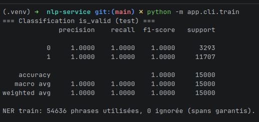
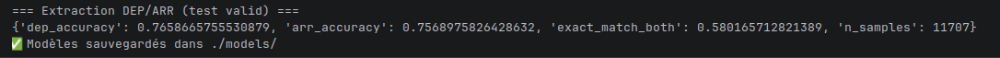
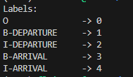
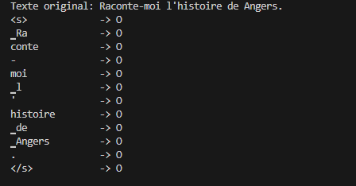
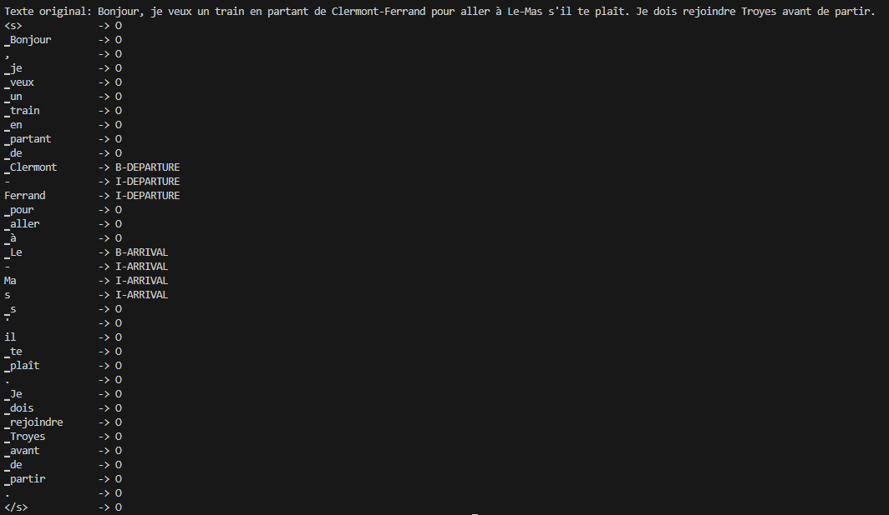
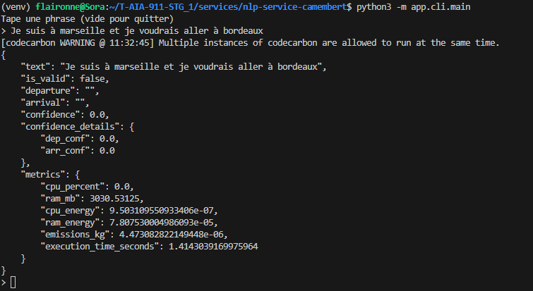

# 🗣️ Service Speech-to-Text (STT)

Le projet intègre un service de reconnaissance vocale (STT) pour convertir les requêtes vocales des utilisateurs en texte exploitable par le pipeline NLP.

L'application mobile, créée avec React Native, permet à l'utilisateur de saisir sa requête de trajet en train via la voix. Le service STT utilise la librairie `expo-speech-recognition` pour capturer et transcrire la parole en texte, qui est ensuite envoyé à l'API Laravel qui s'occupe de l'orchestration des services NLP et Pathfinder.

### Fonctionnalités clés du service STT :
- **Transcription en temps réel :** La transcription de la parole est effectuée en temps réel, offrant une expérience utilisateur fluide.
- **Support multilingue :** Bien que le projet soit principalement en français, la librairie utilisée supporte plusieurs langues, permettant une future extension à d'autres marchés.
- **Intégration transparente :** Le service STT est intégré de manière transparente dans le pipeline de traitement, assurant que les requêtes vocales sont correctement formatées pour le service NLP.
- **Gestion des erreurs :** Le service inclut des mécanismes de gestion des erreurs pour traiter les cas où la transcription pourrait être incorrecte ou incomplète, garantissant ainsi une robustesse accrue du système global.


# 📚 Génération et structuration du dataset
## 1. Objectif
L’objectif du dataset est d’entraîner un système NLP capable de :

Déterminer si une phrase correspond à une demande de trajet en train (is_valid)
Extraire la ville de départ
Extraire la ville d’arrivée
Le dataset simule des requêtes réalistes en français, incluant des variations linguistiques et du bruit contrôlé.

## 2. Méthodologie de génération
Le corpus a été généré de manière synthétique à l’aide :

d’un script Python de génération contrôlée
d’un ensemble de templates linguistiques définis par nos soins
d’un modèle d’IA générative utilisé comme outil d’augmentation linguistique
Utilisation d’une IA générative
L’IA générative a été utilisée dans une démarche de prompt engineering structuré.

Nous avons fourni des instructions précises concernant :

les structures syntaxiques attendues
la présence obligatoire d’une origine et d’une destination
l’inclusion de phrases invalides
l’introduction de bruit linguistique
la diversité des formulations
L’IA n’a pas généré librement du texte : elle a été guidée par un cahier des charges précis afin de produire des phrases exploitables pour l’apprentissage supervisé.

Les annotations finales (spans caractères, entités canoniques et surfaces) ont été générées et vérifiées programmaticalement afin de garantir la cohérence et la reproductibilité du dataset.

## 3. Structure des phrases
### 3.1 Requêtes valides simples
Exemples :

Je voudrais aller de Toulouse à Bordeaux
Je veux un billet de train de Paris à Lyon
Trajet Strasbourg Marseille
Il y a-t-il des trains de Nantes à Montaigu ?
### 3.2 Requêtes avec structures variées
Depuis Paris, je veux aller à Strasbourg
Je souhaite me rendre à Lyon depuis Marseille
Paris Toulouse
Paris -> Toulouse
### 3.3 Phrases invalides
Exemples :

Bonjour
Quel temps fait-il à Paris ?
Je veux du caca
Je veux un billet
Ces phrases permettent d’entraîner la classification is_valid.

## 4. Injection de bruit (data augmentation)
Afin d’améliorer la robustesse du modèle, du bruit contrôlé a été introduit :

Variations de casse (paris, PARIS, PaRiS)
Suppression d’accents (Orléans → Orleans)
Variation tirets / espaces (Saint-Denis → Saint Denis)
Fautes de frappe simulées (Nantes → Nates, Paris → Parais)
Ordre syntaxique variable
Environ 30 % des phrases contiennent au moins une forme de bruit linguistique.

## 5. Annotation des données
Chaque phrase valide contient :

departure_canonical
arrival_canonical
departure_surface
arrival_surface
departure_span_start
departure_span_end
arrival_span_start
arrival_span_end
Les spans caractères permettent d’identifier précisément la position des entités dans le texte.

Exemple
Je veux aller de Strasbourg à Marseille
departure_span_start = 17 arrival_span_start = 30

L’utilisation des spans garantit :

aucune perte d’exemples valides
une annotation cohérente
un apprentissage fiable du modèle NER
## 6. Jeux de données générés
Dataset 10 000 phrases (version initiale)
Élément	Valeur
Nombre total de phrases	10 000
Phrases valides	~82 %
Phrases invalides	~18 %
Annotation	DEP / ARR + spans
Ce dataset a permis de valider le pipeline complet (classification + NER).

Dataset 100 000 phrases (version augmentée)
Élément	Valeur
Nombre total de phrases	100 000
Schéma	Identique au dataset 10k
Objectif	Améliorer la généralisation
Ce dataset a permis d’augmenter fortement la diversité linguistique et de réduire l’overfitting.

## 7. Justification des choix
L’approche synthétique présente plusieurs avantages :

Contrôle total des annotations
Reproductibilité complète
Diversité linguistique élevée
Génération rapide de volumes importants
Possibilité d’introduire des cas ambigus et du bruit contrôlé
## 8. Limites
Données synthétiques (non issues d’utilisateurs réels)
Possible biais lié aux templates
Liste de villes contrôlée et non exhaustive
Ces limites pourront être adressées par l’intégration future de données réelles.

Résumé
Nous avons utilisé une approche hybride combinant génération programmatique et IA générative dans une démarche de prompt engineering structuré afin de produire un dataset contrôlé, annoté et adapté à notre tâche NLP.

# 🧠 NLP Service – Scikit-learn + CRF NER

Extraction de villes de départ et d’arrivée depuis une phrase utilisateur.

---

## 🎯 Objectif

Ce service NLP permet d’extraire automatiquement :

- La ville de départ  
- La ville d’arrivée  
- Déterminer si la phrase est une demande de trajet valide (`is_valid`)  

à partir d’une phrase utilisateur saisie dans un chatbot.

### Exemple

Entrée :

Je veux aller de Paris à Lyon demain matin  

Sortie :

is_valid = True  
departure = Paris  
arrival = Lyon  

Le modèle repose sur une approche classique Machine Learning combinant :

- Une classification binaire (valide / invalide)  
- Un modèle NER basé sur un Conditional Random Field (CRF)

---

## 🏗 Architecture NLP

Dataset CSV  
↓  
Split train / val / test  
↓  
Classification (is_valid)  
- TF-IDF  
- Logistic Regression  
↓  
NER  
- Tokenisation  
- Feature engineering  
- CRF  
↓  
Évaluation  
↓  
Sauvegarde modèles  
↓  
Service Predictor  

---

## 📦 Dataset

### Format utilisé

Chaque ligne du dataset contient :

| Colonne | Description |
|----------|-------------|
| text | Phrase utilisateur |
| departure_span_start | Index début ville départ |
| departure_span_end | Index fin ville départ |
| arrival_span_start | Index début ville arrivée |
| arrival_span_end | Index fin ville arrivée |
| is_valid | 1 si phrase valide |

Les spans permettent de générer automatiquement les labels BIO pour l’entraînement du modèle NER.

---

## ✂️ Split des données

Script : split_chargeur.py  

Répartition :

- 70 % Train  
- 15 % Validation  
- 15 % Test  

Caractéristiques :

- Stratification sur `is_valid`  
- random_state = 42  

---

## 🤖 Modèles utilisés

### Classification – is_valid

Pipeline :

TfidfVectorizer  
→ LogisticRegression  

Pourquoi ce choix ?

- Modèle simple et rapide  
- Très performant sur texte court  
- Faible coût computationnel  
- Suffisant pour une tâche binaire  

---

### NER – Conditional Random Field (CRF)

Implémentation : sklearn-crfsuite  

Pourquoi un CRF ?

- Adapté aux tâches séquentielles  
- Prend en compte le contexte des tokens voisins  
- Léger comparé aux Transformers  
- Interprétable  
- Suffisant pour un vocabulaire contrôlé  

---

## 🏷 Stratégie d’annotation (BIO)

Labels utilisés :

O  
B-DEP  
I-DEP  
B-ARR  
I-ARR  

Signification :

- B- : début d’une entité  
- I- : continuation d’une entité  
- O : hors entité  

Exemple :

Phrase :  
Je vais de Paris à Lyon  

Je → O  
vais → O  
de → O  
Paris → B-DEP  
à → O  
Lyon → B-ARR  

---

## 🔎 Tokenisation et Feature Engineering

Pour chaque token, nous extrayons :

- Le token en minuscule  
- Le token original  
- Longueur du token  
- Si le token est en majuscule  
- Si le token commence par une majuscule  
- Si le token contient un tiret  
- Si le token est numérique  
- Le token précédent  
- Le token suivant  

Cette approche permet au CRF d’apprendre des motifs comme :

- de + VILLE  
- depuis + VILLE  
- VILLE à VILLE  

---

## ⚙️ Entraînement

### Classification

- TfidfVectorizer  
- LogisticRegression (max_iter = 1000)  

### CRF – Hyperparamètres

| Paramètre | Valeur |
|------------|--------|
| algorithm | lbfgs |
| c1 | 0.1 |
| c2 | 0.1 |
| max_iterations | 100 |
| all_possible_transitions | True |

Signification :

- c1 → régularisation L1  
- c2 → régularisation L2  
- all_possible_transitions → autorise toutes les transitions BIO possibles  

---

## 📊 Métriques

### Classification

- Accuracy  
- Precision  
- Recall  
- F1-score  

### NER

- Accuracy départ  
- Accuracy arrivée  
- Exact match (DEP + ARR corrects)  

Pourquoi exact match ?

Car l’objectif métier exige que les deux villes soient correctes simultanément.

---

## 📊 Évaluation du modèle

### 1. Protocole d’évaluation

L’évaluation du modèle a été réalisée sur le **jeu de test**, représentant **15 %** du dataset total.

Ce jeu de test est :

- Strictement séparé des données d’entraînement
- Jamais vu pendant le training
- Stratifié selon la variable `is_valid`
- Généré avec un `random_state = 42` afin d’assurer la reproductibilité

L’objectif de cette évaluation est de mesurer :

- La performance de la classification (`is_valid`)
- La qualité de l’extraction des entités (ville de départ et ville d’arrivée)

---

### 2. Résultats – Classification `is_valid`

La classification binaire a été évaluée à l’aide des métriques suivantes :

- Accuracy
- Precision
- Recall
- F1-score

#### Résultats obtenus

Insérer ici le screenshot du `classification_report` :



Figure 1 – Résultats de la classification sur le jeu de test.

#### Analyse

Le modèle atteint une **accuracy de 1.00** sur le jeu de test.

Cela s’explique par :

- Une séparation claire entre phrases valides et invalides
- Une forte cohérence du dataset synthétique
- Une tâche binaire relativement bien définie

La précision et le rappel sont également équilibrés, indiquant l’absence de biais significatif entre les classes.

---

### 3. Résultats – Extraction des entités (NER)

L’extraction des entités a été évaluée uniquement sur les phrases valides du jeu de test.

Les métriques suivantes ont été calculées :

- Accuracy pour la ville de départ
- Accuracy pour la ville d’arrivée
- Exact match (les deux entités correctes simultanément)

#### Résultats obtenus

Insérer ici le screenshot des métriques NER :



Figure 2 – Performances du modèle NER sur le jeu de test.

Les performances observées sont :

- DEP accuracy ≈ 0.75  
- ARR accuracy ≈ 0.75  
- Exact match ≈ 0.58  

#### Analyse

L’extraction d’entités est significativement plus complexe que la classification binaire.

Une accuracy d’environ 75 % par entité montre que :

- Le modèle apprend correctement les structures typiques telles que « de + VILLE » ou « VILLE à VILLE »
- Le CRF exploite efficacement le contexte local des tokens

Cependant, l’exact match (≈ 58 %) révèle que :

- Il est plus difficile d’extraire simultanément les deux entités correctement
- Certaines erreurs surviennent sur des formulations plus atypiques
- Le modèle peut confondre l’ordre départ / arrivée dans certaines structures inversées

---

### 4. Interprétation globale

Les résultats démontrent que :

- La classification `is_valid` est maîtrisée
- L’extraction NER atteint des performances satisfaisantes pour une approche légère sans Transformer
- Le modèle est fonctionnel et exploitable dans un contexte applicatif

Ces performances valident le choix d’une architecture basée sur :

- TF-IDF + Logistic Regression pour la classification
- CRF pour l’extraction séquentielle

---

### 5. Limites observées

Certaines erreurs apparaissent dans les cas suivants :

- Structures syntaxiques rares
- Formulations ambiguës
- Ordres inversés non fréquents dans le dataset
- Villes peu représentées

Ces limites pourront être améliorées via :

- Un enrichissement du dataset
- Une augmentation de la diversité linguistique
- Un benchmark avec un modèle Transformer (ex : CamemBERT)

---

### Conclusion de l’évaluation

L’évaluation confirme que l’architecture retenue permet :

- Une classification robuste des requêtes
- Une extraction fiable des entités principales
- Une solution légère, rapide et reproductible

Le modèle constitue une base solide pour une application conversationnelle orientée transport.

---

## 🚀 Inference

Pipeline :

Phrase utilisateur  
↓  
Classification (is_valid)  
↓  
Si valide  
↓  
Tokenisation  
↓  
CRF  
↓  
Reconstruction entités  
↓  
Extraction departure / arrival  

Le service supporte :

- Mode CLI  
- Mode API (FastAPI)  
- Traitement synchrone  

---

## 🏁 Conclusion

Ce service implémente une solution NER robuste en français basée sur une approche classique Machine Learning (TF-IDF + Logistic Regression + CRF).

Il permet :

- La détection automatique des requêtes de trajet  
- L’extraction fiable des villes de départ et d’arrivée  

Il constitue la brique NLP centrale du système.

# 🧠 NLP Service – CamemBERT NER

Extraction de villes de départ et d’arrivée depuis une phrase utilisateur.

---

## 🎯 Objectif

Ce service NLP permet d’extraire automatiquement :

- 🟢 La ville de départ
- 🔵 La ville d’arrivée

à partir d’une phrase utilisateur saisie dans un chatbot.

### Exemple

Entrée :

```
Je veux aller de Paris à Lyon demain matin
```

Sortie :

```
departure = Paris arrival = Lyon
```

Le modèle repose sur une approche **Named Entity Recognition (NER)** fine-tunée avec CamemBERT.

---

## 🏗 Architecture NLP

```
Dataset CSV
↓
Split train / val / test
↓
Tokenisation + alignement BIO
↓
Fine-tuning CamemBERT
↓
Évaluation (F1, Precision, Recall)
↓
Sauvegarde modèle
↓
Service Predictor (inference)
```

---

## 📦 Dataset

### Format utilisé (avec spans)

Chaque ligne du dataset contient :

| Colonne              | Description               |
| -------------------- | ------------------------- |
| text                 | Phrase utilisateur        |
| departure_span_start | Index début ville départ  |
| departure_span_end   | Index fin ville départ    |
| arrival_span_start   | Index début ville arrivée |
| arrival_span_end     | Index fin ville arrivée   |
| is_valid             | 1 si phrase valide        |

Le dataset est généré automatiquement via ChatGPT, puis enrichi avec les positions exactes des entités (spans).

---

## ✂️ Split des données

Script : `split_chargeur.py`

Répartition :

- 70% Train
- 15% Validation
- 15% Test

Caractéristiques :

- Stratification sur `is_valid`
- `random_state = 42` pour reproductibilité

---

## 🤖 Modèle utilisé

Modèle de base :

`camembert-base`

### Pourquoi CamemBERT ?

- Pré-entraîné sur un large corpus français
- Architecture Transformer (BERT-like)
- Performant pour le NER
- Adapté au langage conversationnel

---

## 🏷 Stratégie d’annotation (BIO)

Labels utilisés :

```
O
B-DEPARTURE
I-DEPARTURE
B-ARRIVAL
I-ARRIVAL
```



Signification :

- **B-** : début d’une entité
- **I-** : continuation d’une entité
- **O** : hors entité

### Exemple

Phrase :

```
Je vais de Paris à Lyon
```

| Token | Label       |
| ----- | ----------- |
| Je    | O           |
| vais  | O           |
| de    | O           |
| Paris | B-DEPARTURE |
| à     | O           |
| Lyon  | B-ARRIVAL   |

---




## 🔎 Tokenisation et alignement

Problème :

CamemBERT découpe les mots en sous-tokens.

Solution :

- Utilisation de `offset_mapping`
- Alignement des spans caractères avec les tokens
- Attribution automatique des labels BIO

Fonction clé :

```
tokenize_and_align()
```

Cela permet :

- Alignement précis des entités
- Gestion des sous-tokens
- Compatibilité avec HuggingFace Trainer

---

## ⚙️ Entraînement

Hyperparamètres :

| Paramètre     | Valeur |
| ------------- | ------ |
| Batch size    | 8      |
| Epochs        | 5      |
| Learning rate | 2e-5   |
| Weight decay  | 0.01   |

Configuration :

- `eval_strategy = "epoch"`
- `save_strategy = "epoch"`
- `load_best_model_at_end = True`
- `metric_for_best_model = "f1"`

Le meilleur modèle est automatiquement conservé.

---

## 📊 Métriques

Évaluation réalisée avec `seqeval`.

Métriques calculées :

- Precision
- Recall
- F1-score


### Pourquoi F1-score ?

En NER :

- Precision → qualité des entités détectées
- Recall → capacité à détecter toutes les entités
- F1 → équilibre entre précision et rappel

Le modèle est sélectionné selon la meilleure valeur de F1.

---

## 🧪 Évaluation

À la fin de l’entraînement :

```python
trainer.evaluate(test_ds)

```

Permet de mesurer la performance sur des données jamais vues.

## 🚀 Inference

Pipeline d’inférence :

```
Phrase utilisateur
   ↓
Tokenisation
   ↓
Prédiction (logits)
   ↓
Argmax
   ↓
Reconstruction entités
   ↓
Extraction departure / arrival

```

Le service supporte :

Lecture via fichier

Lecture via STDIN

Mode interactif CLI

---



### Points forts

Fine-tuning spécifique au domaine transport

Dataset volumineux (~100k exemples)

Utilisation de spans précis

Splits stratifiés

Métriques adaptées au NER

Pipeline reproductible

---

### ⚠️ Limites

Dataset généré automatiquement (risque de biais)

Sensible aux formulations rares

Ne gère pas encore :

Fautes d’orthographe

Villes implicites

Multi-destinations

---

### 🔮 Améliorations possibles

Data augmentation

Injection de bruit (robustesse aux fautes)

Entraînement sur données réelles utilisateur

Early stopping

Hyperparameter tuning

Distillation vers modèle plus léger

---

### 🏁 Conclusion

Ce service implémente une solution NER robuste en français basée sur CamemBERT pour extraire :

Ville de départ

Ville d’arrivée

Il constitue la brique NLP centrale du chatbot et permet l’extraction automatique d’entités à partir de texte libre.


# 🛤️ Service Pathfinder – Graph Engine (Neo4j)

Calcul d'itinéraire multi-critères et modélisation topologique du réseau ferroviaire.

---

## 🎯 Objectif

Le service **Pathfinder** est le cœur algorithmique du projet. Il transforme une requête d'origine et de destination (extraite par le service NLP) en un itinéraire optimisé en s'appuyant sur une base de données orientée graphe.

### Exemple

**Requête Cypher :**

```cypher
MATCH (start:Stop {name: "Paris"}), (end:Stop {name: "Lyon"})
CALL gds.shortestPath.dijkstra.stream('railwayGraph', {
    sourceNode: start,
    targetNode: end,
    relationshipWeightProperty: 'duration'
})
YIELD nodeIds, costs
```

**Sortie :**
`Path: Paris -> Dijon -> Lyon | Total Duration: 120 min`

---

## 🏗 Architecture du Graphe (Modélisation GTFS)

Le moteur transforme les données statiques **GTFS** (*General Transit Feed Specification*) en un réseau topologique dynamique.

### Étapes d'ingestion :

1. **Normalisation UIC :** Regroupement des *StopPoints* techniques en entités *StopAreas* (Gares) pour simplifier le graphe sans perte d'information géographique.
2. **Modèle Spatio-Temporel :**
* **Nœuds (:Stop) :** Représentent les gares avec propriétés `name`, `uic_code`, `lat`, `lon`.
* **Relations (:RELIÉ_À) :** Connectent deux gares si un trajet direct existe.
* **Pondération (Weighting) :** Chaque relation porte une propriété `weight` calculée dynamiquement () exprimée en minutes.

--- 

## 📥 Source et Pipeline d’Ingestion des Données

Le graphe est construit à partir des données officielles SNCF publiées en open data sur le portail gouvernemental (format CSV conforme GTFS).

📂 Source des données

- Producteur : SNCF
- Publication : portail open data du gouvernement français
- Format : fichiers CSV
- Standard : GTFS (General Transit Feed Specification)

Les principaux fichiers exploités :
- stops.txt
- trips.txt
- stop_times.txt
- routes.txt


### Processus de peuplement de la base

#### Extraction

Les fichiers CSV sont téléchargés puis intégrés dans un pipeline d’import automatisé.

Problème rencontré :
Les volumes sont conséquents (plusieurs centaines de milliers de lignes).
Un import direct via requêtes unitaires rendait les transactions trop lourdes.

Solution :
Import par batchs avec transactions fractionnées pour éviter la saturation mémoire.

#### Transformation

Les données GTFS brutes ne sont pas directement exploitables sous forme de graphe.

Travail effectué :
- Regroupement des points d’arrêt techniques en entités de gare via le code UIC
- Nettoyage des doublons et harmonisation des noms
- Calcul des durées entre deux gares à partir des champs arrival_time / departure_time
- Filtrage des incohérences (durées négatives, trajets incomplets)

Difficulté principale :
Certaines gares apparaissaient sous différentes variantes d’écriture.
La normalisation par UIC a été indispensable pour garantir l’unicité des nœuds.

#### Changement dans Neo4j

- Création des nœuds (:Stop) avec contrainte d’unicité sur uic_code
- Création des relations pondérées (:RELIÉ_À) avec propriété weight (durée en minutes)
- Indexation full-text sur name pour faciliter l’interfaçage avec le service NLP

Une attention particulière a été portée à l’ordre d’import pour éviter les ralentissements liés aux index et contraintes.


---

## 🤖 Logique de Routage

Le service utilise l'algorithme de **Dijkstra** pour garantir l'optimalité du chemin.

### Pourquoi le Graphe (Neo4j) ?

* **Performance :** Contrairement au SQL qui nécessite des jointures récursives (CTE) coûteuses, Neo4j utilise le *pointer hopping*. Le moteur parcourt **+370 000 relations** en un temps constant  par saut.
* **Flexibilité :** Permet d'ajouter facilement des contraintes (ex: temps de correspondance minimal, types de trains favorisés).

### Stratégie d'indexation

Pour garantir une latence minimale lors de l'inférence :

* **Constraint :** Unicité sur l'ID UIC des gares.
* **Full-text Index :** Sur la propriété `name` pour faciliter le matching avec les sorties du service NLP (gestion des majuscules/accents).

---

## ⚙️ Infrastructure Cloud

Le service est déployé sur **Neo4j Aura Professional** pour assurer une haute disponibilité et une scalabilité horizontale.

### Configuration du Service

Les variables d'environnement nécessaires à la connexion via le driver officiel (Bolt/Neo4j+s) :

| Variable | Valeur |
| --- | --- |
| `NEO4J_URI` | `neo4j+s://f4ce75f0.databases.neo4j.io` |
| `NEO4J_USER` | `neo4j` |
| `NEO4J_PWD` | `TonNouveauMotDePasse123!` |


> [!IMPORTANT]
> **Contrainte de base :** Sur l'instance Aura, la base de données doit impérativement être nommée `neo4j`. Toute tentative de connexion sur une base nommée différemment entraînera une erreur de routage.
---

## 📊 Métriques Techniques

* **Nombre de relations :** ~370 000
* **Temps moyen de réponse :** < 15ms (recherche de chemin complexe)
* **Protocole :** Chiffrement TLS via `neo4j+s` (sécurité bout-en-bout)

---

### 🏁 Conclusion

Le service **Pathfinder** convertit les prédictions textuelles en données concrètes de transport. En combinant la puissance de **Dijkstra** et la flexibilité de **Neo4j**, il assure un calcul d'itinéraire performant, scalable et prêt pour une mise en production.

