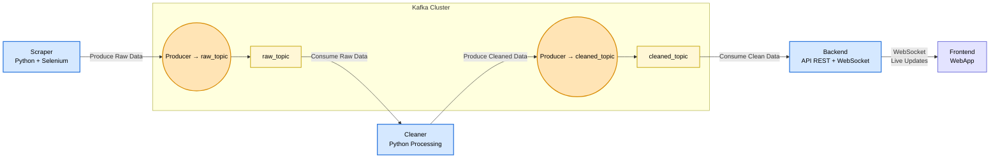

# Projet Crypto-Viz

Crypto Viz est une application web en temps réel destinée aux passionnés et analystes de cryptomonnaies. Elle collecte automatiquement des données financières, les traite pour générer des analyses, et les visualise dynamiquement pour suivre l’évolution des marchés.

## Installation

Installer le projet à l'aide de docker

```bash
  make install
```

Note: le scraper peut mettre plusieurs minutes à s'executer la première fois

Visualiser les topics kafka 

```bash
  make kafka-topics
```

Visualiser les données d'un topic kafka 

```bash
  make kafka-read TOPIC=***
```

Consulter les logs

```bash
  make logs
```

# Architecture


