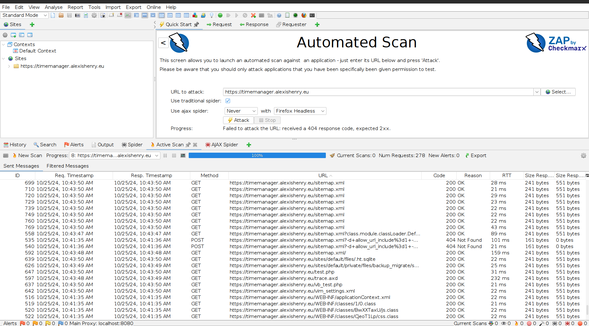
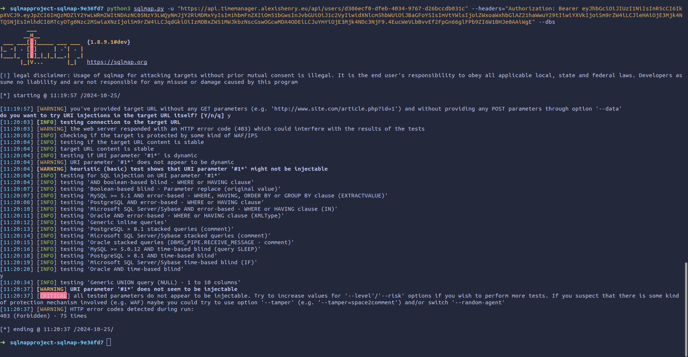
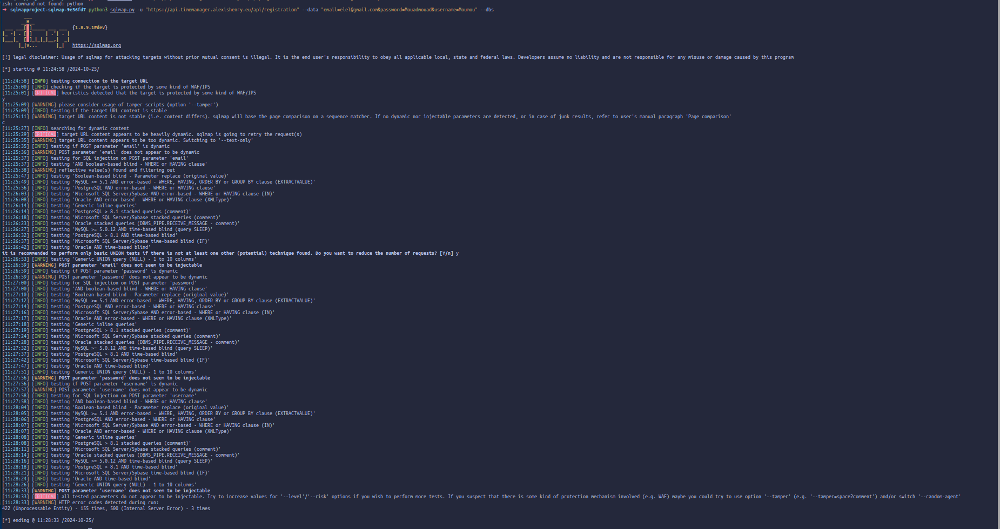
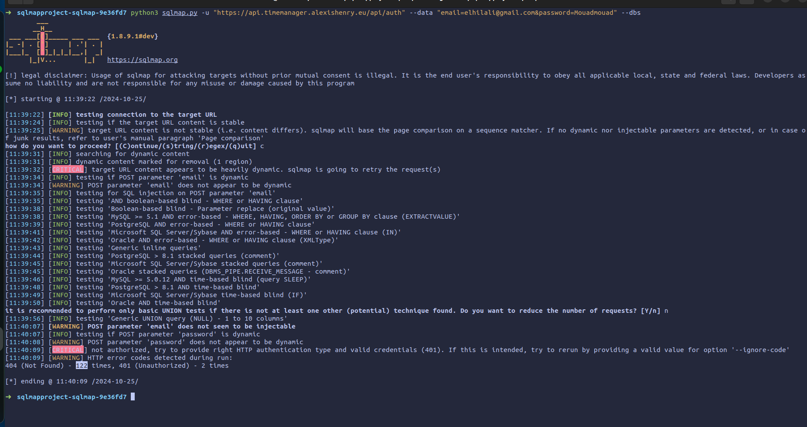
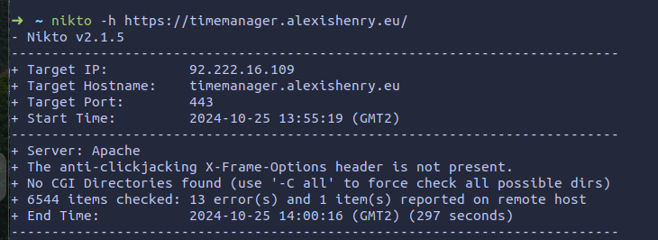

# Security chart

#### <u> Injection Vulnerability (XSS, Script, HTML) </u>

- <u> Owasp zap </u>
  
We scanned the website link:
https://timemanager.alexishenry.eu/

While scanning the page, we did not receive any alerts. The project is secure and does not allow for any injection vulnerabilities. We exported the results in CSV format for backup purposes. The idea is to remain vigilant and conduct regular scans to maintain security.

No Alerts Detected: ZAP did not identify any security issues on this website, suggesting that the project is currently well-secured against common vulnerabilities, such as SQL injection, XSS, and other injection flaws.

[zap_site_results.csv](assets/zap_site_results.csv)

#### <u> SQL/NoSQL Injection Risk </u>
- <u> SQLMap </u>
  
Get user by ID :
```python
python3 sqlmap.py -u "https://api.timemanager.alexishenry.eu/api/users/d306ecf0-dfeb-4034-9767-d26bccdb031c" --headers="Authorization: Bearer" --dbs 
```


Registration :
```
python3 sqlmap.py -u "https://api.timemanager.alexishenry.eu/api/registration" --data "email=elel@gmail.com&password=Mouadmouad&username=Moumou" --dbs
```


Login :
```
python3 sqlmap.py -u "https://api.timemanager.alexishenry.eu/api/auth" --data "email=elhilali@gmail.com&password=Mouadmouad" --dbs
```


#### <u> Accessible Config Files </u>
- <u> Nikto </u>


Nikto performed a comprehensive scan of the web server, searching for exposed configuration files, outdated software, and other security weaknesses that could be exploited by attackers. The tool checked for common vulnerabilities, such as misconfigured permissions, insecure HTTP headers, outdated server software, and publicly accessible administrative files. The detailed scan results, highlighting any detected issues, are displayed in the accompanying image.

#### <u> Strong Password Hashes </u>

We use bcrypt to hash passwords along with a unique salt, making it significantly harder for attackers to crack passwords, even if they gain access to the database. The combination of hashing and salting ensures that each password is uniquely secured, protecting against common attacks like rainbow table lookups and brute force attempts.

#### <u> Unauthorized Route Access </u>

In our project, we implemented a structured approach for managing frontend routes, where each component requires authorization to be accessed. This setup restricts users’ access to only the login and registration pages unless they have the necessary permissions. We configured these access controls in the index.ts file, ensuring that unauthorized users are consistently redirected to the appropriate pages. This centralized authorization helps manage and control user access efficiently, enhancing both security and user experience by guiding users only to pages they are permitted to view.

#### <u> Unauthorized Endpoint Access </u>

For authorization, we use Bodyguard, a middleware that secures all routes by performing checks on every incoming request. This middleware plays a crucial role in ensuring that access controls are applied consistently across the application, protecting routes from unauthorized access. Additionally, through our integration tests, we can continuously verify that these security measures are functioning as intended. These tests help maintain the stability and security of the project, providing confidence that routes remain well-protected as the application evolves.
  
#### <u> Database Overload (DoS Risk) </u>
- <u> Apache JMeter </u> 

As a precaution, we have not conducted a DDoS test on the server yet, as we currently need the site to remain functional. However, before the official project launch, it would be wise to perform this test to ensure the server can withstand such attacks.

#### <u> JWT Tokens HTTP-Only /  HTTPS-Only Application </u>

We store the token in local storage, containing the following information: user ID, username, role, and email. An improvement would be to store the token in cookies with HTTP-Only and HTTPS attributes enabled for enhanced security.

#### <u> Passwords in Plain Text </u>

We hash the password with an added salt, ensuring it is never stored in plain text using bcrypt.

#### <u> Brute Force </u>

We used different lists for brute-forcing the admin password. That never worked because the admin needs to be created with a token. The admin account is created only when needed.